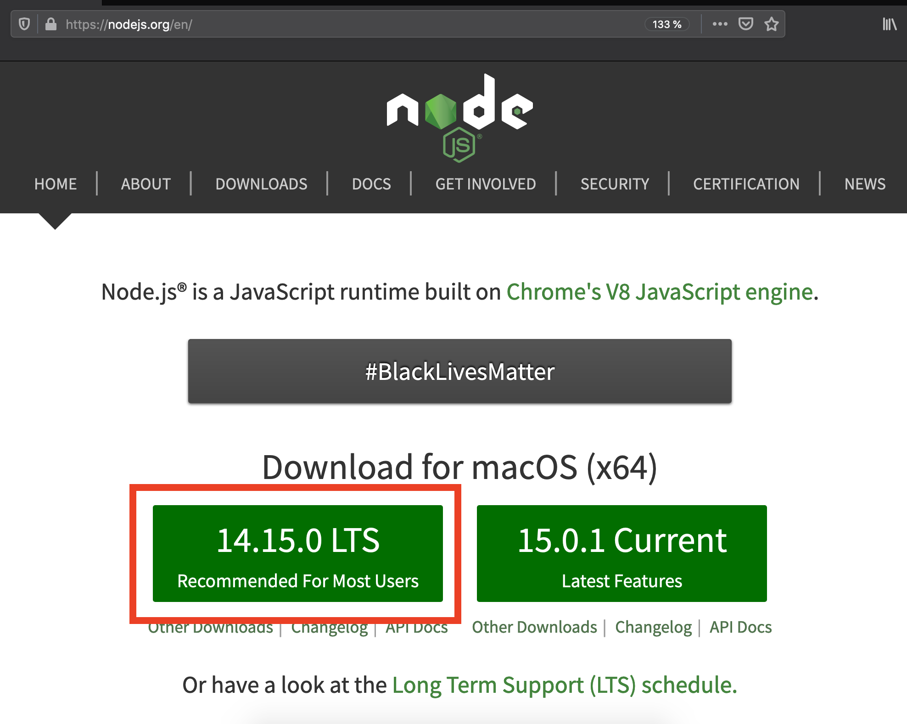
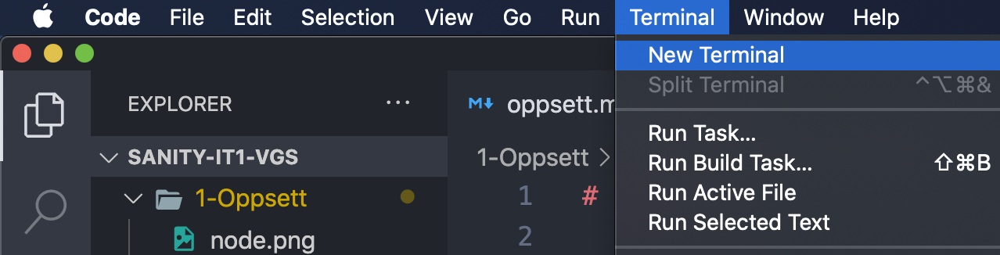
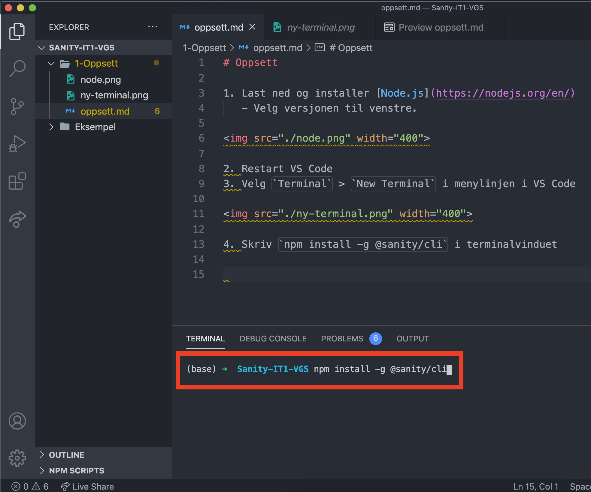

# Oppsett

1. Last ned og installer [Node.js](https://nodejs.org/en/)
   - Velg versjonen til venstre.

2. Restart VS Code
3. Velg `Terminal` > `New Terminal` i menylinjen i VS Code

4. Skriv `npm install -g @sanity/cli` i terminalvinduet, og trykk enter

5. Når installasjonen er ferdig har du Sanity på PCen din.
    - Du kan skrive `sanity --v` i terminalen for å teste om det fungerer, du skal få `@sanity/cli version x.x.x` som svar.
